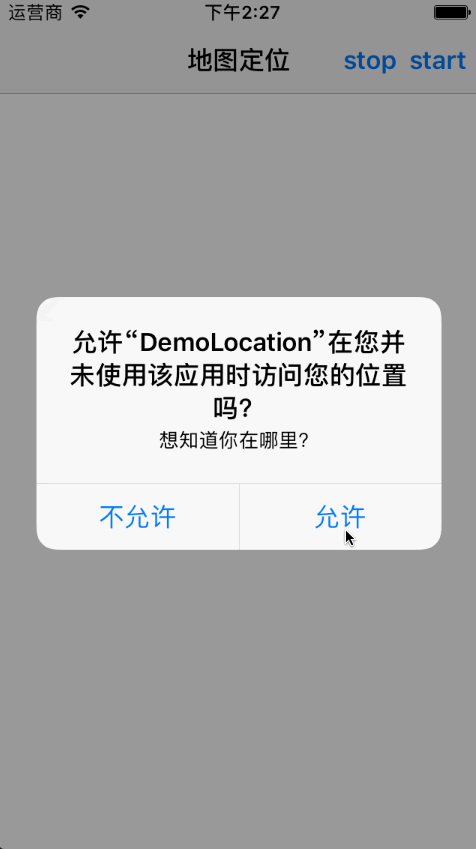

# SYCLLocation
使用系统地图进行定位及反编码（二次封装类，便于开发）

# 效果图

# 使用示例
~~~ javascript
// 导入封装类头文件
#import "SYCLLocation.h"
~~~

~~~ javascript
// 封装方法 开启定位
[[SYCLLocation shareLocation] locationStart:^(CLLocation *location, CLPlacemark *placemark) {

    NSString *name = placemark.name;
    NSString *thoroughfare = placemark.thoroughfare;
    NSString *subThoroughfare = placemark.subThoroughfare;
    NSString *subLocality = placemark.subLocality;
    NSString *administrativeArea = placemark.administrativeArea;
    NSString *subAdministrativeArea = placemark.subAdministrativeArea;
    NSString *postalCode = placemark.postalCode;
    NSString *ISOcountryCode = placemark.ISOcountryCode;
    NSString *country = placemark.country;
    NSString *inlandWater = placemark.inlandWater;
    NSString *ocean = placemark.ocean;
    NSArray *areasOfInterest = placemark.areasOfInterest;
    // 获取城市
    NSString *city = placemark.locality;
    if (!city)
    {
        // 四大直辖市的城市信息无法通过locality获得，只能通过获取省份的方法来获得（如果city为空，则可知为直辖市）
        city = placemark.administrativeArea;
    }

    NSMutableString *text = [[NSMutableString alloc] initWithFormat:@"纬度=%f，经度=%f\n", location.coordinate.latitude, location.coordinate.longitude];
    [text appendFormat:@"city=%@\n", city];
    [text appendFormat:@"name=%@\n", name];
    [text appendFormat:@"thoroughfare=%@\n", thoroughfare];
    [text appendFormat:@"subThoroughfare=%@\n", subThoroughfare];
    [text appendFormat:@"subLocality=%@\n", subLocality];
    [text appendFormat:@"administrativeArea=%@\n", administrativeArea];
    [text appendFormat:@"subAdministrativeArea=%@\n", subAdministrativeArea];
    [text appendFormat:@"postalCode=%@\n", postalCode];
    [text appendFormat:@"ISOcountryCode=%@\n", ISOcountryCode];
    [text appendFormat:@"country=%@\n", country];
    [text appendFormat:@"inlandWater=%@\n", inlandWater];
    [text appendFormat:@"inlandWater=%@\n", inlandWater];
    [text appendFormat:@"ocean=%@\n", ocean];
    [text appendFormat:@"areasOfInterest=%@\n", areasOfInterest];
    NSLog(@"%@", text);

} faile:^(NSError *error) {

    if (error)
    {
        if (([error code] == kCLErrorDenied))
        {
            NSLog(@"定位未打开,请打开定位服务");
        }
        else
        {
            NSLog(@"An error occurred = %@", error);
        }
    }
    else
    {
        NSLog(@"No results were returned.");
    }
}];
~~~ 

~~~ javascript
// 封装方法 结束定位
[[SYCLLocation shareLocation] locationStop];
~~~ 

# 注意事项
* 1、添加CoreLocation.framework
* 2、导入头文件
  * #import <CoreLocation/CoreLocation.h>
  * #import <CoreLocation/CLLocationManager.h>
* 3、plist文件中设置定位的私有属性
  * NSLocationAlwaysUsageDescription 设置为 YES
  * NSLocationWhenInUseUsageDescription 设置为 YES
  * NSLocationUsageDescription 设置提示语，如：想知道你在哪里？

# plist文件配置示意图

## 修改说明
* 20171017
  * 版本号：1.0.1
  * 说明文档完善
  * 添加效果示意图
  * 源码与示例分离

